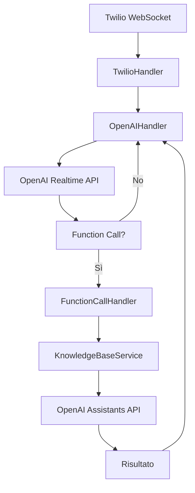

# Server Realtime - Struttura Modulare

Questo server è stato refactorizzato per avere una struttura modulare più pulita e manutenibile.

## 📁 Struttura del Progetto

```
server-realtime/
├── server.js                 # Server principale (entry point)
├── package.json              # Dipendenze e script
├── .env                      # Variabili d'ambiente
└── src/
    ├── config/
    │   └── constants.js      # Configurazione costanti
    ├── handlers/
    │   ├── twilio.js         # Gestione WebSocket Twilio
    │   ├── openai.js         # Gestione WebSocket OpenAI
    │   └── functionCall.js   # Gestione function calls
    └── services/
        └── knowledgeBase.js  # Servizio per ricerca documenti
```

## 🔧 Componenti

### `server.js`

- **Ruolo**: Entry point del server
- **Responsabilità**:
  - Configurazione Express e WebSocket server
  - Health check endpoints
  - Gestione connessioni Twilio

### `src/config/constants.js`

- **Ruolo**: Configurazione centralizzata
- **Contenuto**:
  - URL e configurazioni OpenAI
  - Parametri audio e VAD
  - Headers API

### `src/handlers/twilio.js`

- **Ruolo**: Handler per WebSocket Twilio
- **Responsabilità**:
  - Gestione eventi Twilio (connected, start, media, stop)
  - Creazione e gestione OpenAI handler
  - Cleanup connessioni

### `src/handlers/openai.js`

- **Ruolo**: Handler per WebSocket OpenAI Realtime
- **Responsabilità**:
  - Connessione e configurazione sessione OpenAI
  - Gestione messaggi audio e text
  - Forwarding audio tra Twilio e OpenAI
  - Gestione function calls

### `src/handlers/functionCall.js`

- **Ruolo**: Gestore delle chiamate alle funzioni AI
- **Responsabilità**:
  - Intercettare function calls da OpenAI
  - Coordinare ricerche nella knowledge base
  - Invio risultati back a OpenAI

### `src/services/knowledgeBase.js`

- **Ruolo**: Servizio per ricerca documenti
- **Responsabilità**:
  - Ricerca con assistenti esistenti
  - Creazione assistenti temporanei
  - Gestione API Assistants OpenAI

## 🚀 Come Funziona

1. **Connessione Twilio**: `TwilioHandler` gestisce la connessione WebSocket
2. **Parametri chiamata**: Estrae i parametri e crea `OpenAIHandler`
3. **Sessione OpenAI**: `OpenAIHandler` configura la sessione con tools
4. **Function calls**: `FunctionCallHandler` gestisce le ricerche
5. **Knowledge base**: `KnowledgeBaseService` esegue le ricerche nei documenti

## 🛠️ Modifica e Manutenzione

### Per modificare la configurazione:

- Edita `src/config/constants.js`

### Per modificare la logica Twilio:

- Edita `src/handlers/twilio.js`

### Per modificare la logica OpenAI:

- Edita `src/handlers/openai.js`

### Per modificare la ricerca documenti:

- Edita `src/services/knowledgeBase.js`

### Per aggiungere nuove function calls:

- Edita `src/handlers/functionCall.js`

## 🔍 Vantaggi della Struttura Modulare

- **Separazione delle responsabilità**: Ogni file ha un ruolo specifico
- **Facilità di debug**: Codice organizzato per singola funzionalità
- **Manutenibilità**: Modifiche isolate senza impatti su altri componenti
- **Testabilità**: Ogni modulo può essere testato singolarmente
- **Scalabilità**: Facile aggiungere nuove funzionalità

## 🔄 Flusso di Esecuzione



Questa struttura rende il codice molto più pulito e facile da mantenere! 🎯
